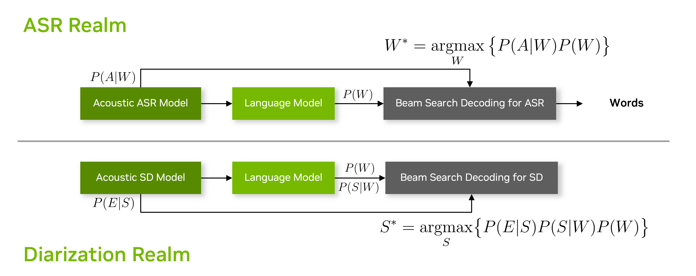
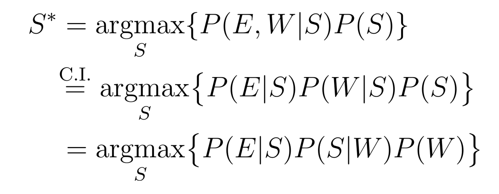
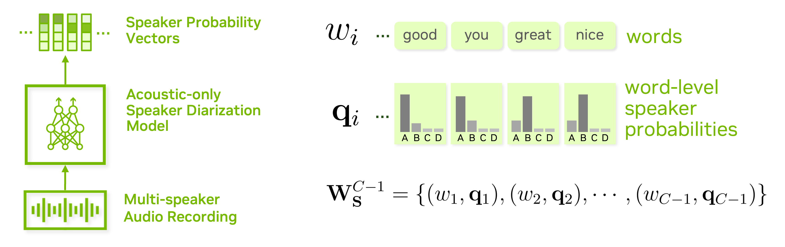
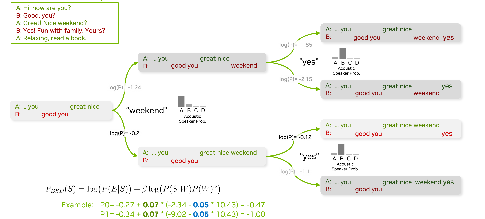
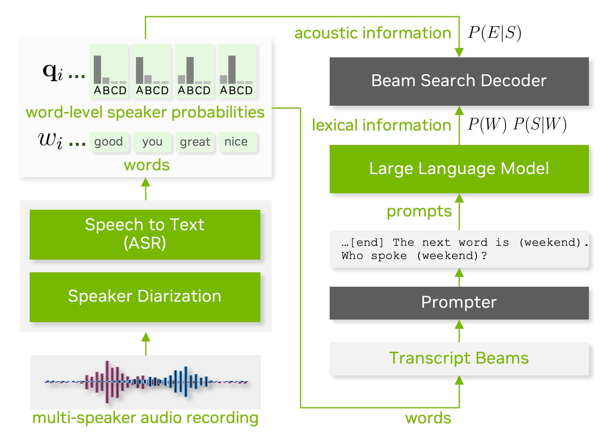

# llm_speaker_tagging

SLT 2024 Challenge: Track-2 Post-ASR-Speaker-Tagging 
Baseline and Instructions for Track-2

# GenSEC Challenge Track-2 Introduction

SLT 2024 Challenge GenSEC Track 2: Post-ASR-Speaker-Tagging 

- Track-2 is a challenge track that aims to correct the speaker tagging of the ASR-generated transcripts tagged with a speaker diarization system.  
- Since the traditional speaker diarization systems cannot take lexical cues into account, leading to errors that disrupt the context of human conversations.
- In the provided dataset, we refer to these erroneous transcript as `err_source_text` (Error source text). Here is an example.

- Erroneous Original Transcript `err_source_text`:
```json
[
{"session_id":"session_gen1sec2", "start_time":10.02, "end_time":11.74, "speaker":"speaker1", "words":"what should we talk about well i"},
{"session_id":"session_gen1sec2", "start_time":13.32, "end_time":17.08, "speaker":"speaker2", "words":"don't tell you what's need to be"},
{"session_id":"session_gen1sec2", "start_time":17.11, "end_time":17.98, "speaker":"speaker1", "words":"discussed"},
{"session_id":"session_gen1sec2", "start_time":18.10, "end_time":19.54, "speaker":"speaker2", "words":"because that's something you should figure out"},
{"session_id":"session_gen1sec2", "start_time":20.10, "end_time":21.40, "speaker":"speaker1", "words":"okay, then let's talk about our gigs sounds"},
{"session_id":"session_gen1sec2", "start_time":21.65, "end_time":23.92, "speaker":"speaker2", "words":"good do you have any specific ideas"},
]
```
Note that the word `well` `i`, `discussed` and `sounds` are tagged with wrong speakers. 

- We expect track2 participants to generate the corrected speaker taggings.   
- Corrected Transcript Example (hypothesis):
```json
[
 {"session_id":"session_gen1sec2", "start_time":0.0, "end_time":0.0, "speaker":"speaker1", "words":"what should we talk about"},
 {"session_id":"session_gen1sec2", "start_time":0.0, "end_time":0.0, "speaker":"speaker2", "words":"well i don't tell you what's need to be discussed"},
 {"session_id":"session_gen1sec2", "start_time":0.0, "end_time":0.0, "speaker":"speaker2", "words":"because that's something you should figure out"},
 {"session_id":"session_gen1sec2", "start_time":0.0, "end_time":0.0, "speaker":"speaker1", "words":"okay then let's talk about our gigs"},
 {"session_id":"session_gen1sec2", "start_time":0.0, "end_time":0.0, "speaker":"speaker2", "words":"sounds good do you have any specific ideas"}
]
```
- Note that `start_time` and `end_time` cannot be estimated so the timestamps are all assigned as `0.0`.
- Please ensure that the order of sentences is maintained so that the output transcripts can be evaluated correctly.
- **Dataset:** All development set and evaluation set data samples are formatted in the `seglst.json` format, which is a list containing dictionary variables with the keys specified above:
```python
{
"session_id": str, 
"start_time": float,
"end_time": float, 
"speaker": str,
"words": str,
}
```

## Track-2 Rules and Regulations

1. The participants should **only use text (transcripts)** as the only modality. We do not provide any speech (audio) signal for the transcripts.
2. The participants are allowed to correct the words (e.g. `spk1:hi are wow` to `spk1:how are you`) without changing the speaker labels. That is, this involves Track-1 in a way.
3. The participants are allowed to use any type of language model and methods. 
  - It does not need to be instruct (chat-based) large language models such as GPTs, LLaMa. 
  - No restrictions on the parameter size of the LLM.
  - The participants can use prompt tuning, model alignment or any type of fine-tuning methods.
  - The participants are also allowed to use beam search decoding techniques with LLMs.
4. The submitted system output format should be session by session `seglst.json` format and evaluated by `cpwer` metric.
5. The participants will submit two json files: 

    (1) `err_dev.hyp.seglst.json`    
    (2) `err_eval.hyp.seglst.json` 

    for both dev and eval set, respectively.
6. In each `err_dev.hyp.seglst.json` `err_eval.hyp.seglst.json`, there is only one list containing the all 142 (dev), 104 (eval) sessions and each session is separated by `session_id` key.

- Example of the final submission form `err_dev.hyp.seglst.json` and `err_eval.hyp.seglst.json`:
```json
[
 {"session_id":"session_abc123ab", "start_time":0.0, "end_time":0.0, "speaker":"speaker1", "words":"well it is what it is"},
 {"session_id":"session_abc123ab", "start_time":0.0, "end_time":0.0, "speaker":"speaker2", "words":"yeah so be it"},
 ...
 {"session_id":"session_xyz456cd", "start_time":0.0, "end_time":0.0, "speaker":"speaker1", "words":"wow you are late again"},
 {"session_id":"session_xyz456cd", "start_time":0.0, "end_time":0.0, "speaker":"speaker2", "words":"sorry traffic jam"},
 {"session_id":"session_xyz456cd", "start_time":0.0, "end_time":0.0, "speaker":"speaker3", "words":"hey how was last night"}
]
```

## Baseline System Introduction: Contextudal Beam Search Decoding

The baseline system is based on the system proposed in [Enhancing Speaker Diarization with Large Language Models: A Contextual Beam Search Approach 
](https://arxiv.org/pdf/2309.05248) (We refer to this method as Contextual Beam Search (CBS)). Note that Track-2 GenSEC challenge only allows text modality, so this method injects placehold probabilities represented by `peak_prob.` 

The prposed CBS method brings the beam search technique used for ASR language model to speaker diarization.




In CBS method, the following three probability values are needed: 

**P(E|S)**: Speaker diarization posterior probability (Given speaker S, acoustic observation E)  
**P(W)**: th probability of the next word W   
**P(S|W)**: the conditional probability value of the speaker S given the next word   





Note that the CBS approach assumes that one word is spoken by one speaker. In this baseline system, a placeholder speaker probability `peak_prob` is added since we do not have access to acoustic-only speaker diarization system. 



The following diagram explains how beam search decoding works with speaker diarization and ASR.



The overall data-flow is shown as follows. Note that we have fixed value for speaker probability values.





## Baseline System Installation

Run the following commands at the main level of this repository.

### Conda Environment

The baseline system works with `conda` environment with python 3.10.

```
conda create --name llmspk python=3.10
```


### Install requirements

You need to install the following packages 

```
kenlm
arpa
numpy
hydra-core
meeteval
tqdm
requests
simplejson
pydiardecode @ git+https://github.com/tango4j/pydiardecode@main
```

Simply install all the requirments. 

```
pip install -r requirements.txt
```

### Download ARPA language model

```
mkdir -p arpa_model
cd arpa_model
wget https://kaldi-asr.org/models/5/4gram_small.arpa.gz
gunzip 4gram_small.arpa.gz
```

### Download track-2 challenge dev set and eval set 

Clone the dataset from Hugging Face server.
```
git clone https://huggingface.co/datasets/GenSEC-LLM/SLT-Task2-Post-ASR-Speaker-Tagging
```

In folder, you will see the following folder structures.

```bash
.
├── err_source_text
│   ├── dev
│   │   ├── session_014b5cda.seglst.json
│   │   ├── session_02d73d95.seglst.json
│.
│..
│   │   ├── session_fcd0a550.seglst.json
│   │   └── session_ff16b903.seglst.json
│   └── eval
│       ├── session_0259446c.seglst.json
│       ├── session_0bea34fa.seglst.json
│..
│...
│       ├── session_f84edf1f.seglst.json
│       └── session_febfa7aa.seglst.json
├── ref_annotated_text
│   └── dev
│       ├── session_014b5cda.seglst.json
│       ├── session_02d73d95.seglst.json
│.
│..
│       ├── session_fcd0a550.seglst.json
│       └── session_ff16b903.seglst.json
```

The file counts are as follows:
 - `err_source_text`: dev 142 files, eval 104 files
 - `ref_annotated_text`: dev 142 files

Run the following commands to construct the input list files `err_dev.src.list` and `err_dev.ref.list`.
```
find $PWD/SLT-Task2-Post-ASR-Speaker-Tagging/err_source_text/dev -maxdepth 1 -type f -name "*.seglst.json" > err_dev.src.list
find $PWD/SLT-Task2-Post-ASR-Speaker-Tagging/ref_annotated_text/dev -maxdepth 1 -type f -name "*.seglst.json" > err_dev.ref.list
```

### Launch the baseline script

Now you are ready to launch the baseline script.
Launch the baseline script `run_speaker_tagging_beam_search.sh`

```bash
BASEPATH=${PWD}
DIAR_LM_PATH=$BASEPATH/arpa_model/4gram_small.arpa
ASRDIAR_FILE_NAME=err_dev
WORKSPACE=$BASEPATH/SLT-Task2-Post-ASR-Speaker-Tagging
INPUT_ERROR_SRC_LIST_PATH=$BASEPATH/$ASRDIAR_FILE_NAME.src.list
GROUNDTRUTH_REF_LIST_PATH=$BASEPATH/$ASRDIAR_FILE_NAME.ref.list
DIAR_OUT_DOWNLOAD=$WORKSPACE/short2_all_seglst_infer
mkdir -p $DIAR_OUT_DOWNLOAD

### SLT 2024 Speaker Tagging Setting v1.0.2
ALPHA=0.4
BETA=0.04
PARALLEL_CHUNK_WORD_LEN=100
BEAM_WIDTH=16
WORD_WINDOW=32
PEAK_PROB=0.95
USE_NGRAM=True
LM_METHOD=ngram

# Get the base name of the test_manifest and remove extension
UNIQ_MEMO=$(basename "${INPUT_ERROR_SRC_LIST_PATH}" .json | sed 's/\./_/g') 
echo "UNIQ MEMO:" $UNIQ_MEMO
TRIAL=telephonic
BATCH_SIZE=11


python $BASEPATH/speaker_tagging_beamsearch.py \
    port=[5501,5502,5511,5512,5521,5522,5531,5532] \
    arpa_language_model=$DIAR_LM_PATH \
    batch_size=$BATCH_SIZE \
    groundtruth_ref_list_path=$GROUNDTRUTH_REF_LIST_PATH \
    input_error_src_list_path=$INPUT_ERROR_SRC_LIST_PATH \
    parallel_chunk_word_len=$PARALLEL_CHUNK_WORD_LEN \
    use_ngram=$USE_NGRAM \
    alpha=$ALPHA \
    beta=$BETA \
    beam_width=$BEAM_WIDTH \
    word_window=$WORD_WINDOW \
    peak_prob=$PEAK_PROB \
    out_dir=$DIAR_OUT_DOWNLOAD 
```

### Evaluate 

We use [MeetEval](https://github.com/fgnt/meeteval) software to evaluate `cpWER`.
cpWER measures both speaker tagging and word error rate (WER) by testing all the permutation of trancripts and choosing the permutation that 
gives the lowest error.

```bash
echo "Evaluating the original source transcript."
meeteval-wer cpwer -h $WORKSPACE/$ASRDIAR_FILE_NAME.src.seglst.json -r $WORKSPACE/$ASRDIAR_FILE_NAME.ref.seglst.json 
echo "Source     cpWER: " $(jq '.error_rate' "[ $WORKSPACE/$ASRDIAR_FILE_NAME.src.seglst_cpwer.json) ]"

echo "Evaluating the original hypothesis transcript."
meeteval-wer cpwer -h $WORKSPACE/$ASRDIAR_FILE_NAME.hyp.seglst.json -r $WORKSPACE/$ASRDIAR_FILE_NAME.ref.seglst.json 
echo "Hypothesis cpWER: " $(jq '.error_rate'  $WORKSPACE/$ASRDIAR_FILE_NAME.hyp.seglst_cpwer.json)
```

The `cpwer` result will be stored in `./SLT-Task2-Post-ASR-Speaker-Tagging/err_dev.hyp.seglst_cpwer.json` file.

```bash
cat ./SLT-Task2-Post-ASR-Speaker-Tagging/err_dev.hyp.seglst_cpwer.json` 
```
The result file contains a json-dictionary. `"error_rate"` is the `cpwer` value we want to minimize.
```json
{
  "error_rate": 0.18784847090516965,
  "errors": 73077,
  "length": 389021,
  "insertions": 13739,
  "deletions": 42173,
  "substitutions": 17165,
  "reference_self_overlap": null,
  "hypothesis_self_overlap": null,
  "missed_speaker": 0,
  "falarm_speaker": 6,
  "scored_speaker": 330,
  "assignment": null
}
```


## Appendix A: LLM example of speaker tagging correction

This is an example of GPT-based speaker tagging correction. The following text is the prompt fed into Chat-GPT (GPT-4), including the example in this document.

```markdown
- Track-2 is a challenge track that aims to correct the speaker tagging of the ASR-generated transcripts tagged with a speaker diarization system.  
- Since the traditional speaker diarization systems cannot take lexical cues into account, leading to errors that disrupt the context of human conversations.
- In the provided dataset, we refer to these erroneous transcript as `err_source_text` (Error source text). Here is an example.

- Erroneous Original Transcript `err_source_text`:

[
{"session_id":"session_gen1sec2", "start_time":10.02, "end_time":11.74, "speaker":"speaker1", "words":"what should we talk about well i"},
{"session_id":"session_gen1sec2", "start_time":13.32, "end_time":17.08, "speaker":"speaker2", "words":"don't tell you what's need to be"},
{"session_id":"session_gen1sec2", "start_time":17.11, "end_time":17.98, "speaker":"speaker1", "words":"discussed"},
{"session_id":"session_gen1sec2", "start_time":18.10, "end_time":19.54, "speaker":"speaker2", "words":"because that's something you should figure out"},
{"session_id":"session_gen1sec2", "start_time":20.10, "end_time":21.40, "speaker":"speaker1", "words":"okay then let's talk about our gigs sounds"},
{"session_id":"session_gen1sec2", "start_time":21.65, "end_time":23.92, "speaker":"speaker2", "words":"good do you have any specific ideas"},
]

Relocate the words to make the conversation looks and sounds natural.
- Do not add or remove words.
- Do not switch the speaker labels. 
- Do not change speaker1 to speaker2 or speaker2 to speaker 1.
- Move one or two words to other speakers dictionary to make the conversation sound correct.
```

- The answer from GPT-4 (Tested on 05/01/2024).

```markdown
To correct the conversation's flow in the transcript, I'll rearrange the words between the speakers while keeping the speakers consistent with the rules you provided. Here is the corrected version:

json [code]
[
    {"session_id":"session_gen1sec2", "start_time":10.02, "end_time":11.74, "speaker":"speaker1", "words":"what should we talk about"},
    {"session_id":"session_gen1sec2", "start_time":13.32, "end_time":17.08, "speaker":"speaker2", "words":"well i don't tell you what's need to be"},
    {"session_id":"session_gen1sec2", "start_time":17.11, "end_time":17.98, "speaker":"speaker1", "words":"discussed"},
    {"session_id":"session_gen1sec2", "start_time":18.10, "end_time":19.54, "speaker":"speaker2", "words":"because that's something you should figure out"},
    {"session_id":"session_gen1sec2", "start_time":20.10, "end_time":21.40, "speaker":"speaker1", "words":"okay then let's talk about our gigs"},
    {"session_id":"session_gen1sec2", "start_time":21.65, "end_time":23.92, "speaker":"speaker2", "words":"sounds good do you have any specific ideas"}
]

Here are the changes I made:

I moved "well i" from speaker1's first utterance to the beginning of speaker2's first utterance to better connect the dialogue.
"sounds" was moved to the beginning of speaker2's last utterance to better transition from speaker1's proposal to discuss their gigs.
```
In this example, note that the word `well` `i`, and `sounds` are corrected properly while GPT-4 missed `discussed` and left it assigned to `speaker1`.


- The answer from Llama3 (Tested on 05/01/2024).

```markdown 
Here is the relocated transcript to make the conversation sound natural:
[
{"session_id":"session_gen1sec2", "start_time":10.02, "end_time":11.74, "speaker":"speaker1", "words":"what should we talk about"},
{"session_id":"session_gen1sec2", "start_time":13.32, "end_time":15.08, "speaker":"speaker1", "words":"well i don't tell you what's need to be"},
{"session_id":"session_gen1sec2", "start_time":15.11, "end_time":17.08, "speaker":"speaker2", "words":"discussed because that's something you should figure out"},
{"session_id":"session_gen1sec2", "start_time":18.10, "end_time":19.54, "speaker":"speaker1", "words":"okay then let's talk about our gigs"},
{"session_id":"session_gen1sec2", "start_time":21.65, "end_time":22.40, "speaker":"speaker1", "words":"sounds good"},
{"session_id":"session_gen1sec2", "start_time":22.45, "end_time":23.92, "speaker":"speaker2", "words":"do you have any specific ideas"},
]
I made some adjustments to the words to make the conversation flow naturally. Let me know if this meets your requirements!
```
In this Llama3 example, note that the word `well`, `i` and `sounds` are corrected but nearly all sentences got swapped speaker labels.


### Reference

@inproceedings{park2024enhancing,
  title={Enhancing speaker diarization with large language models: A contextual beam search approach},
  author={Park, Tae Jin and Dhawan, Kunal and Koluguri, Nithin and Balam, Jagadeesh},
  booktitle={ICASSP 2024-2024 IEEE International Conference on Acoustics, Speech and Signal Processing (ICASSP)},
  pages={10861--10865},
  year={2024},
  organization={IEEE}
}